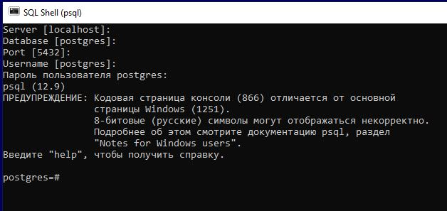
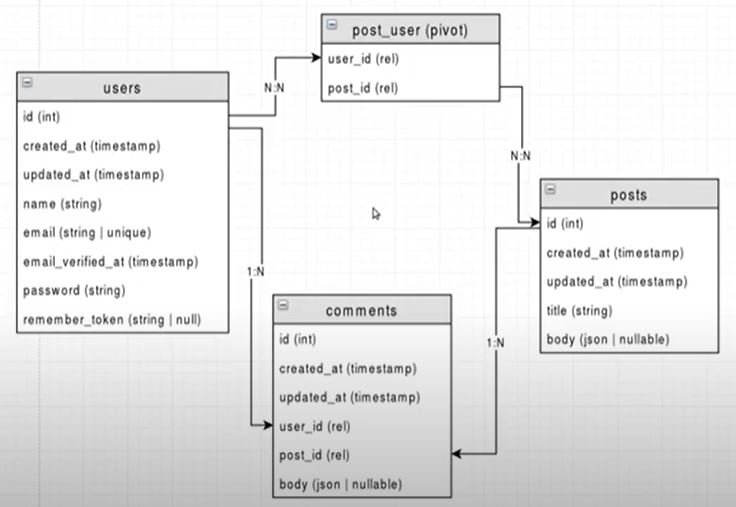
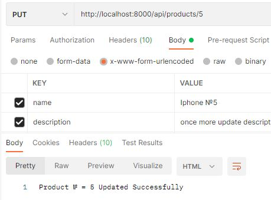
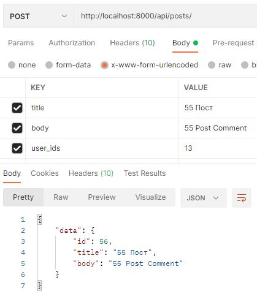
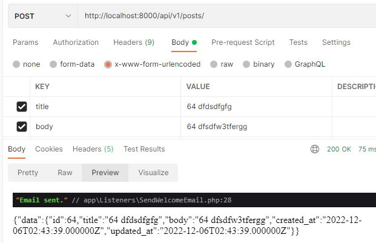
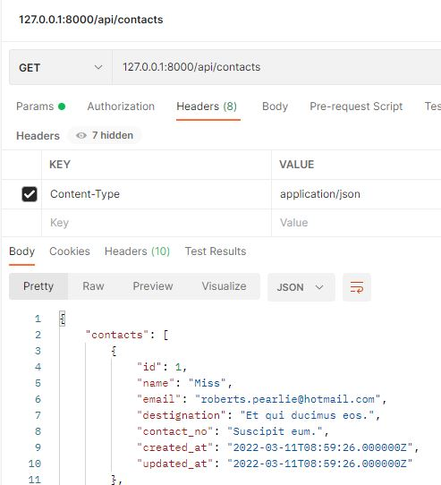
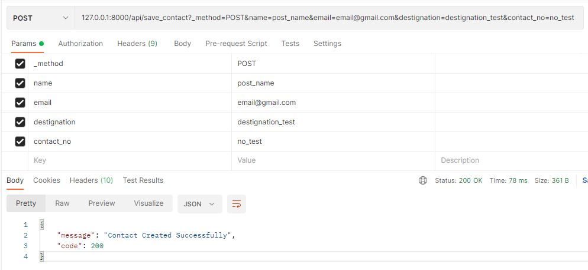

## Main stages of development

#### 1. Installation Project Template. Create Database

`composer create-project --prefer-dist  laravel/laravel .`   
`composer create-project --prefer-dist  laravel/laravel="8.0.*" .` 

`git init`  
`git add .`  
`git commit –m "Install Laravel Template"`  
**`git remote add origin https://github.com/SergeyHub/laravel9_dingo_api.git`**  
`git push -u origin master`  

##### 1.2 Postgersql
```
Let's start SQL Shell (psql). The program will prompt you to enter the name    
of the server, database, port and user. You can click/skip these items as they  
will use the default values   
(for server - localhost, for database - postgres, for port - 5432,  
as user - postres superuser). 
Next, you will need to enter a password for the user   
(by default, the postgres user): 123456 (in my case)  
```

   

`postgres=# create database db_name;`  
  **database list**  
`select datname from pg_database;`   
pg_dump dbname > outfile 

**`Edit  env. file`**    
```
DB_CONNECTION=pgsql
DB_HOST=localhost
DB_PORT=5432
DB_DATABASE=cargo
DB_USERNAME=postgres
DB_PASSWORD=123456
```
##### 1.3 MySQL

`mysql -u root -p`  
`create database crud_api; db_name;`  
`drop database db_name;`   
`show databases;`  
`use db_name;`  
`show tables;`   
`drop table table_name;`  
`exit`  

**`Edit  env. file`**   
```
DB_CONNECTION=mysql
DB_HOST=127.0.0.1
DB_PORT=3306
DB_DATABASE=crud_api
DB_USERNAME=root
DB_PASSWORD=123456
```

#### 2 Install Dingo
  
`composer require api-ecosystem-for-laravel/dingo-api`   
`composer remove api-ecosystem-for-laravel/dingo-api`   
 `php artisan vendor:publish --provider="Dingo\Api\Provider\LaravelServiceProvider"`
 
**`Edit  env. file`**   
```
API_STANDARDS_TREE=vnd
API_SUBTYPE=storeapi
API_VERSION=v1
API_PREFIX=api
API_NAME=StoresAPI
API_DEBUG=true
``` 
   
`git init`  
`git add .`  
`git commit –m "Comment"`  
**`git remote add origin https://github.com/SergeyHub/laravel_crud_api_vue_back.git`**  
`git push -u origin master`  


#### 3 Install jwt-auth

`composer require tymon/jwt-auth:*`  

**`Edit  config/app.php file`**
```
Tymon\JWTAuth\Providers\LaravelServiceProvider::class,
```
#####3.1 Publish the config  
Run the following command to publish the package config file:      

**`php artisan vendor:publish --provider="Tymon\JWTAuth\Providers\LaravelServiceProvider"`**  

You should now have a config/jwt.php file that allows you to configure the basics of this package.

#####3.2 Generate secret key  

`php artisan jwt:secret`  
This will update your .env file with something like JWT_SECRET=foobar  

**`Edit  config/api.php file`**
```
'auth' => [
        'jwt' => 'Dingo\Api\Auth\Provider\JWT'
    ],
```

#### 4. Database Design ER and migration
   
 
`php artisan make:model Post --all --api`  
`php artisan make:model Comment --all --api`
`php artisan make:model Post_User`
`php artisan migrate` 

`git add .`  
`git commit –m "Comment"`  
`git push -u origin master`  

#### 5. Seeds & Factories
seeders->Traits  
`php artisan db:seed`  

#### 6. Edit Post User & Comment models

```
php artisan tinker
Psy Shell v0.11.8 (PHP 8.1.8 — cli) by Justin Hileman
>>> \App\Models\Post::find(1)
=> App\Models\Post {#4101
     id: 1,
     title: "untitled",
     body: "[]",
     created_at: "2022-10-26 19:04:39",
     updated_at: "2022-10-26 19:04:39",
   }

>>> \App\Models\Post::find(10)
=> App\Models\Post {#4717
     id: 10,
     title: "untitled",
     body: "[]",
     created_at: "2022-10-26 19:04:39",
     updated_at: "2022-10-26 19:04:39",
   }
>>> \App\Models\Post::find(10)->comments
=> Illuminate\Database\Eloquent\Collection {#4714
     all: [
       App\Models\Comment {#3765
         id: 2,
         body: "[]",
         user_id: 2,
         post_id: 10,
         created_at: "2022-10-26 19:04:39",
         updated_at: "2022-10-26 19:04:39",
       },
     ],
   }

>>>    
```
#### 7. Edit PostSeeder & CommentFactory. Create FactoryHelper

#### 8. Api Routes
#### 9. UserController
`php artisan make:controller UserController`    
#### 10. Edit api routes
`git push -u origin master`  
#### 11. sclasses table
`php artisan make:model Sclass --all`  
`php artisan make:controller Api/Sclass --resource`  
#### 12. Subject Model route controller request
`php artisan make:model Subject -m`  
`php artisan make:controller Api/SubjectController --resource`  
git push -u origin master  
#### 13. Subject Controller show store update destroy methods
#### 14. Section model Api/SectionController
php artisan make:model Section -m  
php artisan make:controller Api/SectionController --resource  
#### 15. Student model Api/SectionController
php artisan make:model Student -m  
php artisan migrate
php artisan make:controller Api/StudentController --resource  
#### 16. Product Model Migrateion Controller Request
http://localhost:8000/api/products/5  
```
method PUT  
x-www-form-urlencoded  
body  
key value 
name Iphone 5 updated  
description product description updated    
```
   
`git add .`  
`git commit -m "16. Product Model Migrateion Controller Request"`  
`git push -u origin master`   
 ####17. Post resource. DB Transaction post_user table
 `php artisan make:resource PostResource`  
    
#### 18. Edit api routes 
#### 19. Pagination
http://localhost:8000/api/v1/posts?page=1&page_size=7  
#### 20. Edit api routes
#### 21. CommentContoller  
#### 22. PostRepository. Edit PostController   
git push -u origin master  
#### 23. Laravel Exceptions
php artisan make:exception GeneralJsonException  
#### 24. Edit CommentController
#### 25. Create a service class. Use event + event listener
Event Listener = function listens to an event  
 
`php artisan make:event Models/Post/PostCreated`  
`php artisan make:event Models/Post/PostUpdated`  
`php artisan make:event Models/Post/PostDeleted`  
   
Edit \app\Events\Models\Post\PostCreated.php  
```
namespace App\Events\Models\Post;
use App\Models\Post;
protected $post;
public function __construct( $post )
    {
        $this->post = $post;
    }
```
Edit \app\Repositories\PostRepository.php
```
use App\Models\Post;
use App\Events\Models\Post\PostCreated;
use App\Events\Models\Post\PostDeleted;
use App\Events\Models\Post\PostUpdated;

event(new PostCreated($created));
event(new PostUpdated($post));
event(new PostDeleted($post));
```
`php artisan make:listener SendWelcomeEmail`   

Edit \app\Listeners\SendWelcomeEmail.php
```
    public function handle($event)
    {
        dump("Email sent.");
    }
```
`php artisan make:subscriber PostSubscriber`  
Edit \app\Providers\EventServiceProvider.php


 
 
 
 
 
######=================  old  ======================== 
 
-------------------old--------------------
##### 1.3 Migration 

`php artisan migrate`  

##### 1.4 Version
`npm -v`  
`php -v`

#### 2. ContactController Contact Model Table & api route
`php artisan make:controller ContactController`    
`php artisan make:model Contact -m`    
`php artisan migrate`  

#### 3. Table Contact : Seeding
`php artisan make:factory ContactFactory`  
```
return [
    'name' => $this->faker->title(15),
    'email' => $this->faker->email,
    'destignation' => $this->faker->text(25),
    'contact_no' => $this->faker->text(15),
];
```
`php artisan make:seeder ContactSeeder`  
```
Contact::factory()->count(25)->create();
```
`php artisan db:seed --class=ContactSeeder`  

 

#### ContactController saveContact Method  
Create the POST API to insert data in database.   
Test  POST API with postman  

```
        $contact = new Contact();
        $contact->name = $request->name;
        $contact->email = $request->email;
        $contact->destignation = $request->destignation;
        $contact->contact_no = $request->contact_no;

        $contact->save();
        return response()->json([
            'message' => 'Contact Created Successfully',
            'code' => 200

        ]);
```
```
Route::get('contacts', [ContactController::class, 'contacts']);
Route::post('save_contact', [ContactController::class, 'saveContact']);
```
 

#### ContactController deleteContact Method  
#### Staff Controller Model Table
#### Install Vue Front Packages
npm install vue@next  
npm install vue-router@4  
npm install --save axios vue-axios  

`npm install`  
`npm install --save vue@next` 
npm install --save-dev vue-loader@next
`npm install cross-env`  
`npm install --save axios vue-axios`  
`npm install --save vue-router`  
`npm install --save-dev vue vue-template-compiler`  
